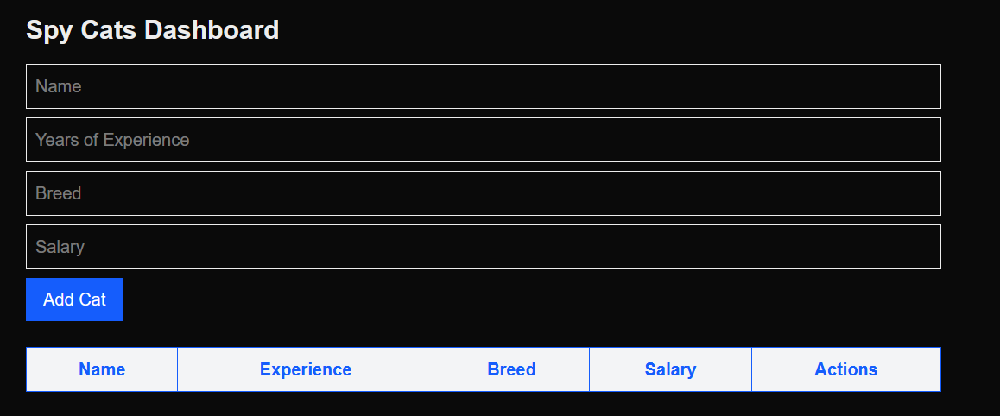

# Cats



## Setup

### Backend

1. Create a virtual environment and activate it:

```bash
cd Cats
python -m venv venv
source venv/bin/activate  # Linux/macOS
venv\Scripts\activate     # Windows
```

2. Install dependencies 
```bash
cd backend
pip install -r requirements.txt
python manage.py makemigrations
python manage.py migrate
```

3. Run server
```bash
python manage.py runserver
```

### Frontend
1. Go to frontend folder
```bash
cd frontend
```

2. Install dependencies:
```bash
npm install
```

3. Start the development server
```bash
npm run dev
```

4. [Open broswer](http://localhost:3000) 

## Postman 

[Postman endpoints](./TestTask.postman_collection.json)